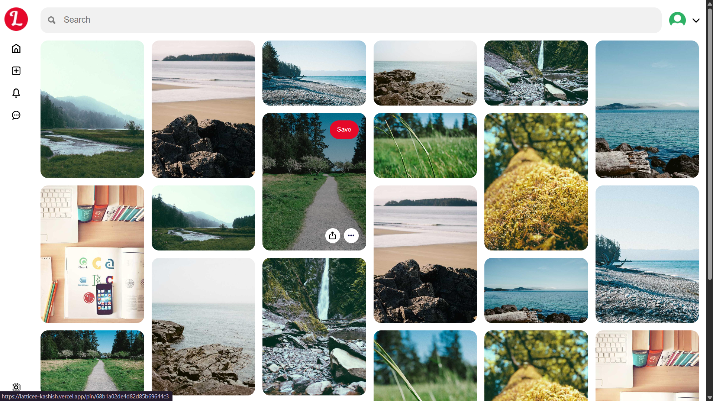
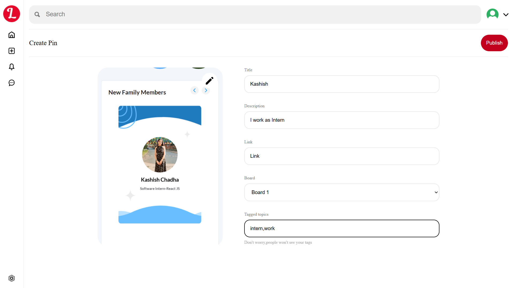
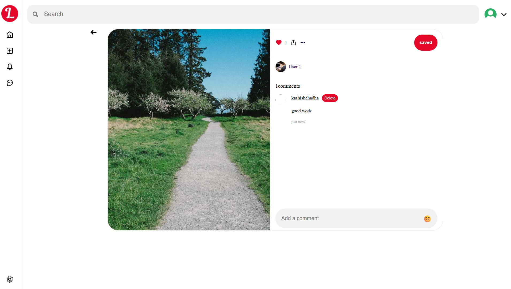
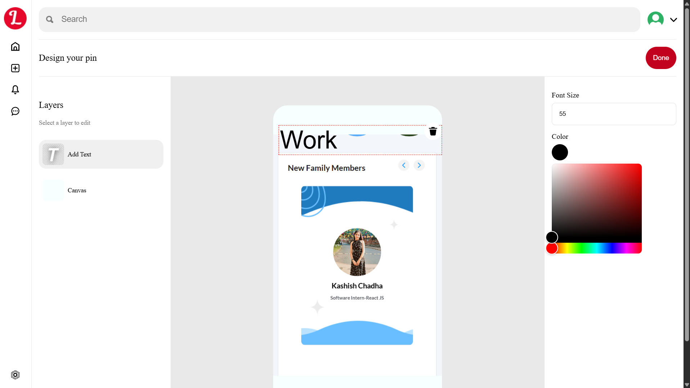
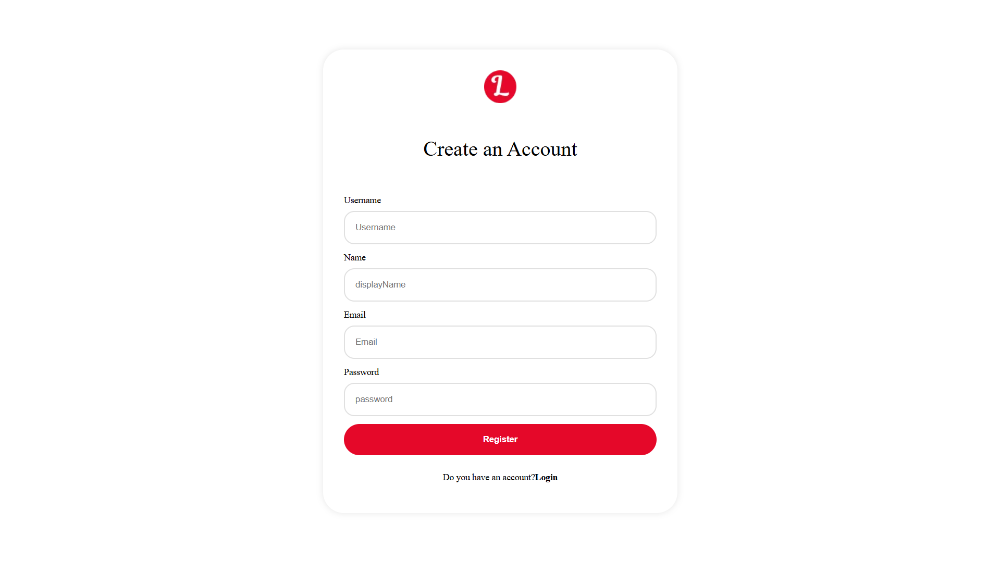
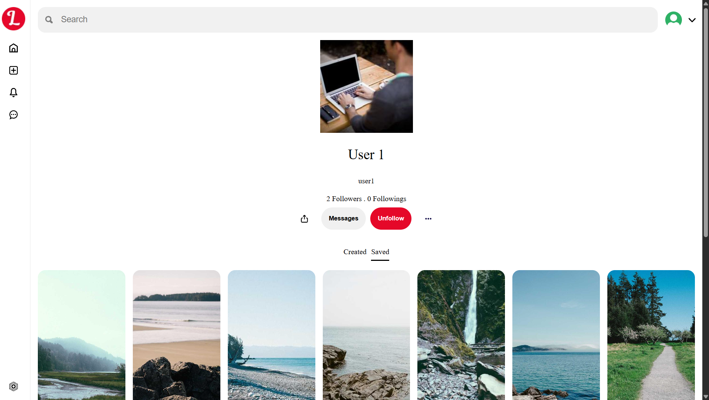

<div align="center">
    
  <h1> Latticee</h1>
  <p><strong>A Modern Visual Discovery & Sharing Platform</strong></p>
  
  <p>
    
    
    
    
    
  </p>

  <p>
    <a href="#features">✨ Features</a> •
    <a href="#tech-stack">🛠️ Tech Stack</a> •
    <a href="#installation">⚡ Installation</a> •
    <a href="#api-routes">🔌 API Routes</a> •
    <a href="#contributing">🤝 Contributing</a>
  </p>
</div>

---

## 📖 About

**Latticee** is a modern visual discovery platform inspired by Pinterest, built with cutting-edge web technologies. Users can create, share, and discover visual content through an intuitive and engaging interface. The platform features a comprehensive pin-based system with user profiles, boards, social interactions, and advanced search capabilities.

### 🎯 Key Highlights

- **Pinterest-like Experience**: Create and organize visual content in boards
- **Social Features**: Follow users, interact with pins, and build communities
- **Advanced Search**: Discover content through intelligent search functionality
- **Real-time Interactions**: Like, save, and comment on pins instantly
- **Responsive Design**: Seamless experience across all devices
- **Secure Authentication**: JWT-based authentication with bcrypt password hashing

---

## ✨ Features

### 📌 Pin Management
- **Create Pins** with image uploads and descriptions
- **Interactive Pin Gallery** with infinite scrolling
- **Pin Details View** with full interactions
- **Board Organization** for content categorization

### 👥 User Experience
- **User Profiles** with follower/following system
- **Authentication System** with secure login/register
- **Social Interactions** - follow/unfollow users
- **Personal Boards** for saving and organizing content
- **Search Functionality** to discover new content

### 🎨 Visual Features
- **Image Upload** with ImageKit integration
- **Responsive Gallery** with masonry-style layout
- **Color Picker** for customization
- **Emoji Support** for enhanced expressions
- **Real-time Updates** with React Query

---

## 📸 Screenshots

<div align="center">

### 🏠 Homepage


### ✍️ Create Post


### 📖 Post View


### 📱 Edit ImagePage


### 📱 Register Page


### 📱 User Page



</div>

---

## 🛠️ Tech Stack

<div align="center">

<table>
<tr>
<td width="50%">

### Frontend
| Technology | Version | Purpose |
|------------|---------|---------|
| **React** | 19.1.0 | UI Framework |
| **Vite** | 7.0.4 | Build Tool & Dev Server |
| **React Router** | 7.8.0 | Client-side Routing |
| **React Query** | 5.85.0 | State Management & Caching |
| **Zustand** | 5.0.7 | Global State Management |
| **Axios** | 1.11.0 | HTTP Client |
| **ImageKit React** | 4.3.0 | Image Management |
| **React Colorful** | 5.6.1 | Color Picker |
| **Emoji Picker React** | 4.13.2 | Emoji Support |
| **React Infinite Scroll** | 6.1.0 | Infinite Scrolling |
| **Timeago.js** | 4.0.2 | Time Formatting |

</td>
<td width="50%">

### Backend
| Technology | Purpose |
|------------|---------|
| **Node.js** | Runtime Environment |
| **Express.js** | Web Framework |
| **MongoDB** | Database |
| **Mongoose** | ODM |
| **JWT** | Authentication |
| **bcryptjs** | Password Hashing |
| **ImageKit** | Image Processing |
| **Sharp** | Image Optimization |
| **CORS** | Cross-Origin Requests |
| **Cookie Parser** | Cookie Management |
| **Express Fileupload** | File Upload Handling |

</td>
</tr>
</table>

</div>

---

## 🚀 Installation

### Prerequisites
- **Node.js** (v16 or higher)
- **MongoDB** (local or cloud)
- **ImageKit Account** for image management
- **Git**

### 1. Clone the Repository
```bash
git clone https://github.com/kashishchadha/Latticee.git
cd Latticee
```

### 2. Backend Setup
```bash
cd backend
npm install
```

Create a `.env` file in the backend directory:
```env
MONGODB_URI=your_mongodb_connection_string
JWT_SECRET=your_jwt_secret_key
IMAGEKIT_PUBLIC_KEY=your_imagekit_public_key
IMAGEKIT_PRIVATE_KEY=your_imagekit_private_key
IMAGEKIT_URL_ENDPOINT=your_imagekit_url_endpoint
PORT=5000
```

Start the backend server:
```bash
npm run dev
```

### 3. Frontend Setup
```bash
cd ../client
npm install
```

Create a `.env` file in the client directory:
```env
VITE_API_URL=http://localhost:5000
VITE_IMAGEKIT_PUBLIC_KEY=your_imagekit_public_key
VITE_IMAGEKIT_URL_ENDPOINT=your_imagekit_url_endpoint
```

Start the frontend development server:
```bash
npm run dev
```

### 4. Access the Application
- **Frontend**: http://localhost:5173
- **Backend API**: http://localhost:5000

---

## 🔌 API Routes

### User Routes (`/api/user`)
- `GET /:username` - Get user profile
- `POST /auth/register` - Register new user
- `POST /auth/login` - User login
- `POST /auth/logout` - User logout
- `POST /follow/:username` - Follow/Unfollow user

### Pin Routes (`/api/pin`)
- `GET /` - Get all pins
- `GET /:id` - Get specific pin
- `POST /` - Create new pin (authenticated)
- `GET /interaction-check/:id` - Check user interactions
- `POST /interact/:id` - Like/Save pin (authenticated)

---

## 📁 Project Structure

```
Latticee/
├── client/                   # React frontend application
│   ├── src/
│   │   ├── components/       # Reusable UI components
│   │   │   ├── leftBar/      # Navigation sidebar
│   │   │   ├── topBar/       # Header component
│   │   │   ├── gallery/      # Pin gallery display
│   │   │   ├── image/        # Image display component
│   │   │   ├── postInteraction/ # Pin interaction controls
│   │   │   ├── comments/     # Comments system
│   │   │   └── boards/       # Board management
│   │   ├── routes/           # Page components
│   │   │   ├── homePage/     # Main feed page
│   │   │   ├── createPage/   # Pin creation page
│   │   │   ├── postPage/     # Individual pin view
│   │   │   ├── profilePage/  # User profile page
│   │   │   ├── searchPage/   # Search functionality
│   │   │   ├── authPage/     # Login/Register page
│   │   │   └── mainLayout/   # Main app layout
│   │   ├── utils/           # Utility functions
│   │   └── App.jsx          # Main app component
│   └── package.json         # Frontend dependencies
│
├── backend/                 # Express.js backend API
│   ├── controllers/         # Route controllers
│   ├── models/              # MongoDB models
│   ├── routes/              # API routes
│   │   ├── pin.route.js     # Pin-related routes
│   │   └── user.route.js    # User-related routes
│   ├── middleware/          # Custom middleware
│   │   └── verifyToken.js   # JWT verification
│   ├── utils/               # Backend utilities
│   ├── index.js             # Server entry point
│   └── package.json         # Backend dependencies
│
└── README.md               # Project documentation
```

---

## 🎨 Scripts

### Frontend
```bash
npm run dev      # Start development server
npm run build    # Build for production
npm run preview  # Preview production build
npm run lint     # Run ESLint
```

### Backend
```bash
npm run dev      # Start development server with watch mode
```

---

## 🌟 Key Features Breakdown

### 🔐 Authentication System
- Secure JWT-based authentication
- Password hashing with bcryptjs
- Protected routes and middleware
- Cookie-based session management

### 📱 Responsive Design
- Mobile-first approach
- Flexible grid layouts
- Touch-friendly interactions
- Cross-browser compatibility

### 🖼️ Image Management
- ImageKit integration for optimization
- File upload with validation
- Image resizing and compression
- CDN delivery for fast loading

### 📊 Social Features
- User profiles with follow system
- Pin interactions (like, save, comment)
- Personal boards and collections
- Activity feeds and notifications

---

## 🌐 Deployment

### Frontend (Vercel/Netlify)
1. Connect your GitHub repository
2. Set environment variables
3. Deploy automatically on push

### Backend (Railway/Heroku)
1. Create a new app on your preferred platform
2. Connect your GitHub repository
3. Set environment variables
4. Deploy the backend directory

---

## 🤝 Contributing

We welcome contributions! Here's how you can help:

1. **Fork** the repository
2. **Create** a feature branch
   ```bash
   git checkout -b feature/amazing-feature
   ```
3. **Commit** your changes
   ```bash
   git commit -m 'Add some amazing feature'
   ```
4. **Push** to the branch
   ```bash
   git push origin feature/amazing-feature
   ```
5. **Open** a Pull Request

### 📋 Contribution Guidelines
- Follow the existing code style
- Write clear commit messages
- Test your changes thoroughly
- Update documentation as needed

---

## 📝 License

This project is open source and available under the [MIT License](LICENSE).

---

## 🙏 Acknowledgments

- **React Team** for the amazing framework
- **Express.js** for the robust backend framework
- **ImageKit** for image management services
- **MongoDB** for database solutions
- **Vite** for lightning-fast development

---

## 📞 Contact

**Kashish Chadha**
- GitHub: [@kashishchadha](https://github.com/kashishchadha)
- Project Link: [https://github.com/kashishchadha/Latticee](https://github.com/kashishchadha/Latticee)

---

<div align="center">
  <p>Made with ❤️ by <a href="https://github.com/kashishchadha">Kashish Chadha</a></p>
  <p>⭐ Star this repo if you find it helpful!</p>
</div>
